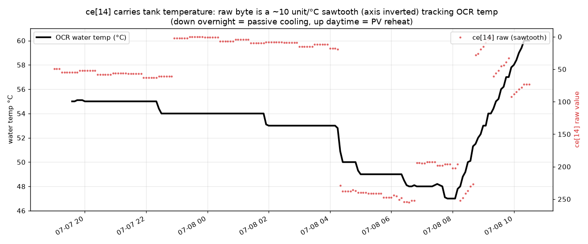
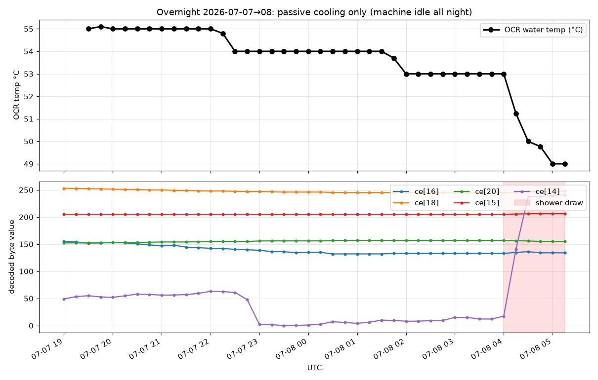
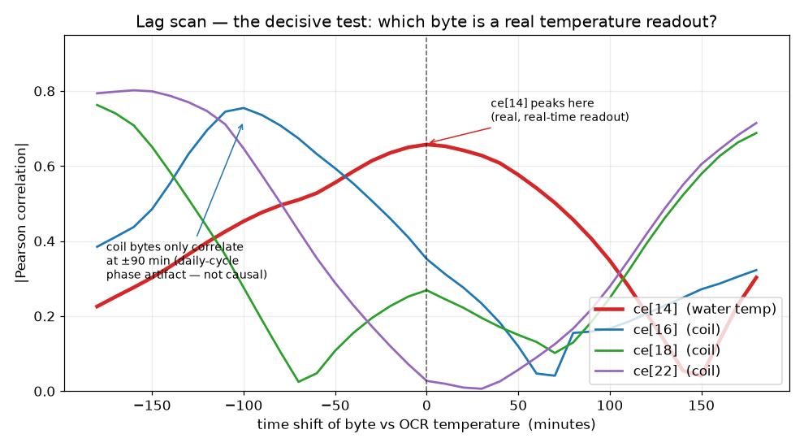
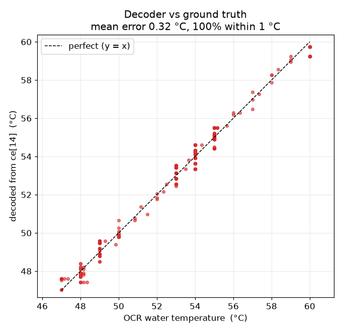
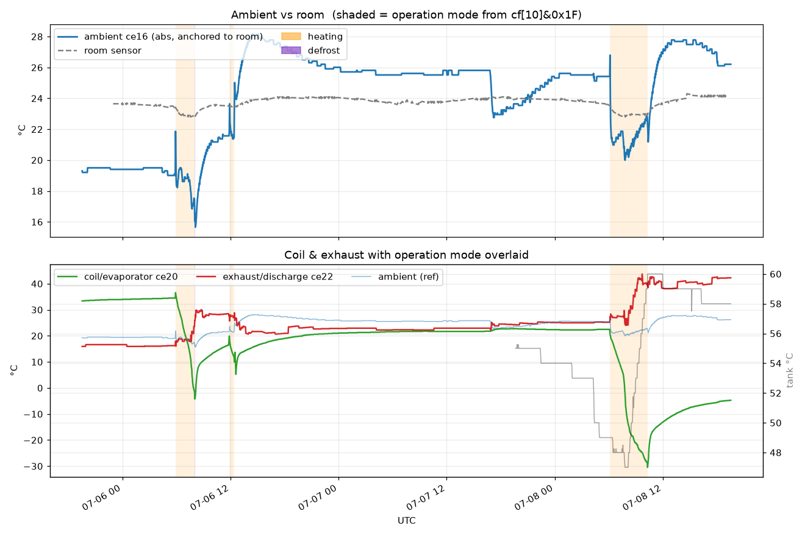
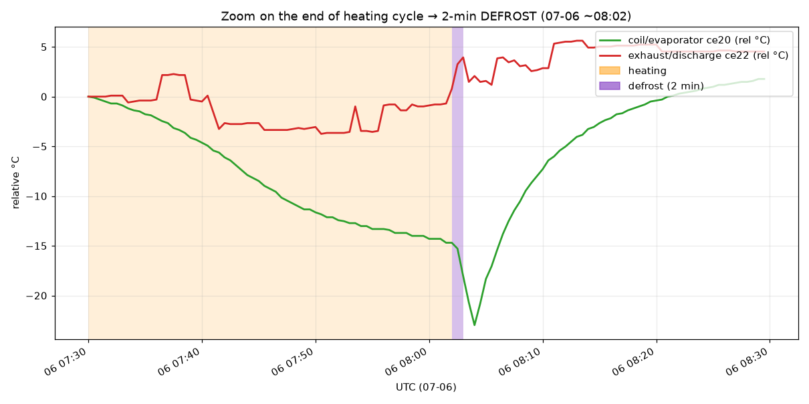

# Reverse-Engineering the Ökoboiler's Internal UART Bus

*Reading water temperature, operating mode and PV state straight off the wire between a heat-pump water heater's two circuit boards — no cloud, no API — and turning it into an ESPHome / Home Assistant sensor.*

---

## TL;DR

My [Ökoboiler](https://www.oekoboiler.com/) heat-pump water heater is an **older generation with no connectivity at all** — no WiFi, no app, no API, nothing to integrate with. Inside, two circuit boards — a **display/operation panel** on the front and the **main control board** — talk to each other over a single-wire serial bus. That bus was the only way in.

So I tapped it with a €5 ESP32, captured the traffic, and reverse-engineered the protocol. The result is a local, cloud-free sensor that reads:

- 🌡️ **Water (tank) temperature** — to ~0.3 °C, *better than the 1 °C front-panel display*
- ⚙️ **Operating mode** (heating / idle / defrost)
- ♻️ **PV / solar mode** — officially absent on my model, but fully present in the firmware; I just added the missing trigger (see below)

Two nice results came out of it. The **water temperature** was the hard one: it's hidden in a byte that **wraps around and has finer resolution than the display**, so it looked like random noise for days. And the **PV mode** turned out to be present in the "cheaper" hardware all along — the bus let me prove it and a €2 relay let me use it.



> The red sawtooth is a single byte off the bus; its envelope is the water temperature (black). Once you know it wraps, it decodes cleanly.

---

## The hardware

| | |
|---|---|
| Appliance | Ökoboiler heat-pump water heater |
| Main control board | **SY-384**, ATmega16-based |
| Bus | Single-wire, half-duplex UART, **2400 baud, 8N1**, optically isolated (PC817) |
| Panel wiring | 3 wires only: **UART data + 5 V + GND** — so the panel has *no* sensors; everything it displays must arrive over the bus |
| Sniffer | ESP32-C6, running ESPHome, RX tapped onto the data line |

That "3 wires only" detail mattered: it proved the water temperature the panel shows **must** be transmitted from the main board over this bus. It was in there somewhere — I just had to find it.

---

## Step 1 — Framing: finding structure in the bytes

Dumping the raw UART stream, a repeating **32-byte frame** jumped out, always starting with the same two bytes:

```
64 41 ...  (32 bytes)  ... <CRC>
```

- **`0x64 0x41`** — fixed frame header.
- Frames arrive at ~3 per second, continuously, in two flavours (more on that below).

### The XOR mask

The payload looked scrambled — until I noticed **byte 5 changes every frame**, and if you XOR bytes 2–29 with it, the frame becomes stable and readable:

```
decoded[i] = raw[i] ^ raw[5]      for i = 2 … 29
```

Bytes 0, 1, 30, 31 are left as-is. After demasking, a constant **signature appears at bytes 6–9: `F2 D4 F9 61`** — a great sanity check that you've decoded correctly (in my capture it had zero variance across hundreds of thousands of frames).

<details>
<summary><strong>Why mask the payload at all?</strong></summary>

It's tempting to call this "encryption," but it isn't — the key is `raw[5]` itself, sent in the clear, and it decodes to `dec[5] = raw[5] ^ raw[5] = 0`. Anyone on the bus can unmask everything (which is exactly what I did). So it buys no secrecy. The more likely reasons are mundane and electrical:

- **Line whitening.** This is a single wire through PC817 optocouplers, and most of the payload is *constant* — the `F2 D4 F9 61` signature every frame, plus most sensor bytes when nothing is changing. Without masking, the identical bit pattern goes out ~3×/second forever. XOR-ing with a value that changes each frame keeps the average bit density varied even when the data is static, which is friendlier to the optocoupler's duty cycle and spreads EMI energy out instead of concentrating it at the frame-rate harmonics.
- **Byte 5 is probably a rolling counter anyway.** For the mask to do anything, `raw[5]` has to change frame-to-frame. It may primarily be a sequence/heartbeat byte, with the whitening a free side effect of XOR-ing against it.
- **Mild obfuscation.** Not real security, but enough of a speed bump to stop a casual glance at the bus from revealing structure.

My best guess is the first two together: a per-frame counter reused as a cheap whitener to keep the isolated line well-behaved. (You can lean one way or the other by watching how `raw[5]` evolves: a clean increment/roll points to a counter; pseudo-random points to a deliberate scrambler.)

</details>

### The checksum

Bytes 30–31 are a **CRC-16/Modbus** over bytes 0–29, stored little-endian:

```
crc = crc16_modbus(frame[0..29])      // poly 0xA001, init 0xFFFF
crc_frame = frame[30] | (frame[31] << 8)
```

100 % of well-formed frames validated. From here on I only trusted CRC-valid frames — essential, because a corrupted-but-header-valid frame will otherwise flip your decoded values.

### Two directions

Decoded **byte 11** is either **`0xCE`** or **`0xCF`** — the two frame families, one per direction of the conversation. Throughout this write-up I call them the **CE** and **CF** frames. (Which board sends which is a separate rabbit hole; for building sensors it doesn't matter — what matters is *which family a given value lives in*.)

---

## Step 2 — The easy wins: mode and PV

Two fields fell quickly by just watching decoded **byte 10** while poking the machine:

- **`byte10 & 0x1F`** → operating mode: `0x10` = heating, `0x19` = idle/warm, `0x1D` = defrost.
- **`byte10 & 0x40`** → PV bit: **clear = PV (solar) mode ON**. I confirmed this by toggling PV and watching the bit flip in real time.

These are redundantly present across several bytes, but `byte10` is the cleanest source. Done — but the PV bit turned into its own little adventure.

### Bonus: driving PV/solar mode on a model sold without it

When I bought this, Ökoboiler offered two near-identical versions: one advertised **with** a PV/solar mode (it raises the tank setpoint to soak up surplus solar), and a cheaper one **without**. Mine is the "without".

Except it basically isn't. PV mode is right there in the **settings menu** — in fact it's **documented in the manual that shipped with the unit** — including separate target temperatures for PV-on and PV-off. The firmware fully supports it. The only thing the pricier "PV" model really adds is *something to drive the trigger*.

And that trigger is on the board: the schematic has a terminal labelled **"PV Input"**. So I enabled PV mode in the menu, wired a **[Shelly 1 Mini Gen3](https://www.shelly.com/) relay** onto that PV Input line, and let **[Solar Manager](https://www.solarmanager.ch/)** close it whenever my system has surplus solar. The boiler jumps to its PV setpoint on sunny afternoons — and the bus decode above reads the resulting PV state straight back, confirming it worked.

> The "non-PV" unit had full PV support baked into firmware *and* documented in the manual — it just needed a signal on one terminal. A small relay and a solar controller, and it behaves exactly like its pricier sibling. 🙂

---

## Step 3 — The water-temperature hunt

This took *days*, several wrong answers, and a change of method. It's the interesting part.

### Why the naive approach fails

The obvious idea: note the temperature on the display, look at the bytes, repeat, and spot the byte that matches. I tried this many times. Every candidate died on the next reading. For example, one byte read `0x58` = 88 while the display showed 58 °C (looks like it could be a scaled value!) — but at the next 58 °C reading it was 94, and at 59 °C it was **80** (*lower* at a *higher* temperature).

The reason is subtle and important: **the board reads several temperature sensors** — the tank, plus the heat-pump's own probes (evaporator/coil, ambient, exhaust…) — and their bytes all shift around with the **operating state**: compressor on/off, defrost, PV. Two moments that show the same tank temperature on the display can have wildly different coil/exhaust readings. **Spot-checks confound temperature with machine state.** You cannot solve this with a handful of labels.

> Worth noting: **only the tank temperature is ever shown on the display.** That's exactly why it's the one field I could eventually pin down against ground truth — and why the other sensors (below) stay out of reach.

I needed a lot of labelled data across a real temperature *sweep*.

### Ground truth: OCR the display

I already had a camera + 7-segment OCR pointed at the front panel (from an earlier project), logging the displayed temperature into InfluxDB. I re-enabled it. Now I had two synchronized time series:

- The **displayed temperature** (ground truth), every ~30 s.
- **Every decoded byte**, ~3× per second.

Now I could **correlate**, mechanically, instead of guessing.

> #### 📎 What "correlation" means here (Pearson *r*)
>
> For every moment in time I have a pair of numbers: *(displayed temperature, one byte's value)*. **Pearson correlation** boils the whole relationship down to a single number **between −1 and +1** that answers: *as the temperature rises and falls over the day, does this byte rise and fall in lockstep?*
>
> - **r = +1** — perfect: when temperature goes up, the byte goes up, proportionally.
> - **r = −1** — perfect *inverse*: temperature up ⇒ byte down. (Just as useful — the tank byte actually counts *down*.)
> - **r = 0** — no linear relationship; the byte ignores temperature.
>
> The **sign** tells you the direction, the **size** tells you how tight the link is. A byte that *is* the temperature scores close to ±1; a random byte scores near 0. So I compute *r* for all ~60 bytes and rank them.
>
> <details><summary>The formula, if you want it</summary>
>
> Subtract each series' average, multiply the two deviations at each instant, sum, and divide by the spread of each series:
> ```
>       Σ (xᵢ − x̄)(yᵢ − ȳ)
> r = ─────────────────────────────
>     √[ Σ(xᵢ − x̄)² · Σ(yᵢ − ȳ)² ]
> ```
> The top is large-positive when both series sit above/below their means *together*, large-negative when they're opposite, ~0 when unrelated. Dividing by the spreads makes it unit-free, so it always lands in [−1, +1]. (`x` = temperature, `y` = the byte.)
> </details>
>
> **The catch — and it bit me hard:** Pearson only sees *straight-line* relationships, and it's easily fooled by a **shared trend**. If two things both just slide downward over a night, they'll correlate near 1 — *even if they have nothing to do with each other*. That's exactly the next trap.

### Trap #1: passive cooling is degenerate

The first night's data looked promising — a clean 6 °C drift down as the tank cooled overnight — but the correlation was useless. When temperature falls *monotonically*, **every** byte that happens to drift monotonically correlates with it at ~0.98. Coil, ambient, exhaust — they all cool together. You can't tell them apart.



> Overnight the machine never ran (top: temperature just coasts down). Every candidate byte (bottom) drifts down together — and some *reverse upward* at the morning shower (red band) exactly when the tank drops hardest. That upward reversal is the fingerprint of a **coil** sensor lagging the tank, not the tank itself.

The discriminator I needed was a **heating** event: a moment when the tank temperature moves *differently* from everything else.

### The V-sweep

The machine reheats the tank during the day when PV/solar is available. So I waited for a full cycle: **cool down overnight (55 → 49 °C), then reheat during the day (49 → 60 °C)** — a "V" in the temperature curve. Now the true tank byte had to trace *both* legs; coil sensors would diverge during the compressor-driven reheat.

### Trap #2: the winners were fake — until the lag scan

Even over the full V, ordinary correlation still flagged several coil bytes at ~0.9. To separate real from coincidental, I ran a **time-lag scan**. This was the turning point:

> #### 📎 What a time-lag scan is (and why it's decisive)
>
> Ordinary correlation compares the two series at the **same instant**. A lag scan asks a sharper question: *what if I deliberately slide the byte series forward or backward in time before comparing?* Shift it by −60 min, −30, 0, +30, +60… and recompute Pearson *r* at each shift. Then plot *r* against the shift.
>
> - A byte that **is the real temperature readout** matches the temperature *right now*. Slide it either way and the match gets worse — so its correlation **peaks sharply at lag 0**.
> - A byte that only *looks* correlated because it rides the **same daily heating cycle** — like a coil sensor that follows the same clock but trails the tank by a couple of hours — matches best when you slide it by that offset. Its peak sits at **lag ≠ 0** (here, ~90–120 minutes).
>
> **Analogy:** two clocks. If they always show the same time, they're the same clock (peak at lag 0). If clock B is always 2 hours behind clock A, they're strongly related but they are *not the same clock* — and "2 hours" is exactly the shift where they line up. The tank sensor is the *same clock* as the display; the coil sensors are *2-hours-behind clocks* that merely follow the same daily schedule.
>
> So the lag scan cleanly separates **"is literally this quantity"** (peak at 0) from **"merely follows the same daily rhythm"** (peak offset) — which plain correlation cannot. *(One caveat: because everything runs on a ~24 h cycle, the curves rise again at very large shifts as one day re-aligns with the next — that's aliasing, so I zoom to ±3 h and only trust peaks near zero.)*




> **`ce[14]` (red) peaks sharply at lag 0** — it tracks the temperature *now*, like a real readout. The coil bytes only correlate at a **~90–120 minute lag** — they and the tank temperature both follow the daily heating cycle, just phase-shifted. That's a *daily-rhythm coincidence*, not causation. (They also flip correlation sign between the heating and cooling legs — another tell that they're not the tank.)

`ce[14]` — decoded byte 14 of the CE frames — was the answer. It had been hiding in plain sight, dismissed as "noise" early on.

### Why byte 14 looked like noise

`ce[14]` uses the **full 0–255 range** and jumps around, because it has **much finer resolution than the display and it wraps**. Averaging it over time (as I did early on) turns a fast, wrapping ramp into hash. Once I looked at it at full rate — and reconstructed whole frames to confirm it's *stable when the temperature is stable* and *not multiplexed* — the structure appeared:

![ce[14] mod 64 vs temperature](images/fig_sawtooth.png)

> Take `ce[14] mod 64` and plot it against temperature: a clean line. The byte **falls ~10 units per °C** and **wraps every ~6.4 °C**. Colour is the coarse-band byte `ce[15]` (below).

So:

```
fine temperature ≈ (constant − 10.14 × T)      encoded in ce[14], wrapping
```

### The coarse companion

A wrapping fine value is ambiguous on its own (which 6.4 °C window are we in?). The disambiguator turned out to be **decoded byte 15**, which acts as a coarse band flag:

- **`ce[15] = 206`** → tank is in the **~47–52 °C** band
- **`ce[15] = 205`** → tank is in the **~51–60 °C** band

Crucially, I found `ce[15]` **from the byte stream alone**, without any OCR labels — the byte data is high-rate enough to reveal the encoding structure directly. (A few days of wider temperature swings will map more of its values.)

<details>
<summary><strong>Why is the temperature split into a wrapping fine byte plus a coarse band?</strong></summary>

This `(fine that wraps, coarse band)` layout isn't an accident — it's what you get naturally when a raw sensor reading is handed across the bus, and it turns out to be a sensible choice:

- **It's the shape of the raw measurement.** A temperature this fine (~0.1 °C/step over the whole working range) needs more than 8 bits. Rather than pack it into an awkward field, the firmware just sends the **low byte** (the fast-moving fine part) and a **high byte / band** (the slow-moving coarse part) separately — a plain little split of a wider counter. The fine byte "wraps" simply because it's the low byte rolling over every 256 steps (≈ every 6.4 °C at ~10 units/°C).
- **The same format fits every sensor.** All five channels use the identical `(fine, coarse)` pairing (see below), so this is the board's *generic* way of shipping a sensor value, not something special-cased for the tank. One layout, reused five times, is cheaper to implement than five bespoke encodings.
- **Resolution the display throws away.** The panel only ever shows whole degrees, so the extra precision in the fine byte is invisible on the unit — which is exactly why it looked like noise until I correlated it. The control board keeps the full resolution internally (it needs it for its own regulation) and simply streams it; the display rounds at the very end.

So the wrap is a side effect of byte-splitting a higher-resolution value, and the coarse band is the high part that tells you which wrap you're in. Once you see it as "low byte + high byte of one number," it stops looking mysterious.

</details>

---

## Step 4 — The decoder

Putting it together, temperature is:

```
T (°C) = 60.62 − 0.0986 × unwrapped(ce[14])
```

where `unwrapped(ce[14])` resolves the wrap. I implemented **two** ways to do that, because they have different failure modes and it's fun to compare them live:

**Decoder A — continuity (incremental).** Track `ce[14] mod 64` frame-to-frame like a rotary encoder; each wrap adds/subtracts 64. Re-anchor to absolute truth whenever the tank dips into the unambiguous `ce[15] = 206` band (which is narrower than one wrap). **Precise (~0.3 °C)**, but after a reboot it needs to see one sub-52 °C dip to re-anchor.

**Decoder B — stateless.** Compute the temperature fresh from `(ce[15], ce[14])` on every frame, with a full-byte tiebreak inside the wide band. **No memory, survives reboots instantly**, ~1 °C.

Validated against the OCR ground truth over the whole sweep:



> **Mean error 0.32 °C, 100 % of readings within 1 °C** — the decoded byte is *more* precise than the whole-degree front-panel display.

---

## Step 5 — ESPHome integration

The whole thing runs on an ESP32 as an ESPHome UART sniffer that publishes to Home Assistant. The decode is a small lambda; see [`esphome/oekoboiler-sniffer.yaml`](esphome/oekoboiler-sniffer.yaml) for the complete, ready-to-flash config (with your own secrets). The core of it:

```cpp
// CE frames only, CRC-valid. byte14 = fine temp (wraps), byte15 = coarse band.
if (masked_frame[11] == 0xCE) {
  const float WT_A = 60.62f, WT_B = 0.0986f;   // T = A - B*(fine + acc)
  int fine = masked_frame[14] % 64;
  int b15  = masked_frame[15];

  // Decoder A: continuity, re-anchored in the unambiguous b15==206 band
  if (b15 == 206) {
    id(wt_acc) = 64 * (int) lroundf((112.8f - fine) / 64.0f);
    id(wt_anchored) = true;
  } else if (!id(wt_anchored)) {
    id(wt_acc) = 64 * (int) lroundf((51.9f - fine) / 64.0f);
    id(wt_anchored) = true;
  } else {
    int d = fine - id(wt_prev_fine);
    if (d > 32) id(wt_acc) -= 64;
    else if (d < -32) id(wt_acc) += 64;
  }
  id(wt_prev_fine) = fine;
  id(water_temp_continuity).publish_state(WT_A - WT_B * (fine + id(wt_acc)));

  // Decoder B: stateless
  int raw = masked_frame[14];
  float center = (b15 == 206) ? 49.5f : 55.5f;
  int k = (int) lroundf((((WT_A - center) / WT_B) - fine) / 64.0f);
  float tempB = WT_A - WT_B * (fine + 64 * k);
  if (b15 != 206) {
    if (raw >= 64 && tempB < 57.0f) tempB = WT_A - WT_B * (fine + 64 * (k - 1));
    if (raw <  64 && tempB > 57.5f) tempB = WT_A - WT_B * (fine + 64 * (k + 1));
  }
  id(water_temp_stateless).publish_state(tempB);
}
```

---

## Bonus: mapping the other four sensors

The tank isn't the only thing on the bus. Once I knew the tank was a `(fine, coarse)` byte **pair** (`ce14`+`ce15`), I checked whether the other "drift" bytes follow the same pattern — and they do, perfectly. Every fine byte (many values, wraps) has a companion coarse byte (just 2–4 values):

| pair | sensor | how I identified it |
|---|---|---|
| `ce14/15` | **tank** | the display (already decoded) |
| `ce16/17` | **ambient / intake air** | correlates with a **same-room temperature sensor** I have in Home Assistant — r = **−0.82** while the unit is idle |
| `ce20/21` | **evaporator / coil** | **plunges cold exactly when the boiler is in `heating` mode** — textbook evaporator |
| `ce22/23` | **exhaust / discharge gas** | **rises hot** during `heating` |
| `ce18/19` | **return gas** | the unpopulated channel — no coherent signal |

Two things made this possible *without any display readout for these sensors*:

1. **A borrowed ground truth for ambient.** The boiler's in the garage, and I have a room temperature sensor there. During idle the ambient channel tracks it tightly (r = −0.82); the correlation weakens during operation precisely because the heat pump **cools its own intake air** — a real, visible effect.
2. **A cross-check from a field I'd already decoded.** Overlaying the operating mode (`cf[10]&0x1F = heating`) onto the sensor traces, *every* heating span lines up with the coil plunging, the exhaust rising, and ambient dipping. Two independently-decoded parts of the protocol agreeing is strong confirmation — of both the sensor IDs *and* the mode decode.



> Orange = `heating` mode. Coil (green) plunges, exhaust (red) rises, ambient (blue, top) dips below the room sensor — all exactly during heating. 07-07 had no heating cycle, and the coil stays flat at ambient.

Defrost also appears in the mode field, but only as a **~2-minute blip at the end of a heating cycle** — too brief to see on the 3-day chart above. Zooming in to one hour makes it visible:



> The defrost band (violet, ~2 min) sits right at the end of heating. The coil is at its coldest there, then recovers to ambient as the compressor stops — **no hot-gas spike**, so in a warm garage this reads as an end-of-cycle routine rather than real ice-melting. (A winter defrost might look different — worth revisiting.)

**The honest caveat:** these absolute numbers are *approximate*. I assumed the tank's slope (~10 units/°C) for every channel, which is almost certainly too steep — ambient swings wider than the room really does, and the coil bottoms out at an unrealistic −30 °C. **The shapes and identities are solid; the magnitudes are stretched.** Each sensor has its own scale that I can't pin without per-channel ground truth (a clamp-on probe for the coil/exhaust; a wider room-temperature swing for ambient). But even uncalibrated, the coil trace is a superb evaporator/defrost signal, and ambient is good to a degree or two.

---

## Protocol summary

Full details in [`PROTOCOL.md`](PROTOCOL.md). The short version:

| Field | Location (after XOR-demasking with `raw[5]`) | Meaning |
|---|---|---|
| Header | `raw[0..1] = 64 41` | Frame start |
| XOR mask | `raw[5]` | XOR key for bytes 2–29 |
| Signature | `dec[6..9] = F2 D4 F9 61` | Constant; decode sanity check |
| Frame family | `dec[11] = CE / CF` | Direction / message type |
| Operating mode | `dec[10] & 0x1F` (CF) | `10`=heat `19`=idle `1D`=defrost |
| PV mode | `dec[10] & 0x40` (CE) | clear = PV on |
| **Water temp (fine)** | **`dec[14]` (CE)** | **~10 units/°C, wraps ~6.4 °C, falls as temp rises** |
| **Water temp (coarse band)** | **`dec[15]` (CE)** | **206 ⇒ 47–52 °C, 205 ⇒ 51–60 °C** |
| Ambient / intake | `dec[16]/[17]` (CE) | `(fine,coarse)` pair, same format |
| Evaporator / coil | `dec[20]/[21]` (CE) | `(fine,coarse)` pair |
| Exhaust / discharge | `dec[22]/[23]` (CE) | `(fine,coarse)` pair |
| Return gas | `dec[18]/[19]` (CE) | present in format, sensor unpopulated |
| CRC | `raw[30..31]` | CRC-16/Modbus over `raw[0..29]`, little-endian |

---

## What's still open

- **Calibration range.** The temperature constants are fitted over **47–60 °C** (all my tank has done during capture). Outside that, `ce[15]` takes values I haven't mapped yet. A big draw down toward ~40 °C plus a full reheat will extend it, and the constants get refined into a single closed-form.
- **Absolute calibration of the other sensors.** Ambient, coil and exhaust are now *identified* (see the section above) but their absolute magnitudes are approximate — each needs its own scale. Coil/exhaust would need a **clamp-on probe** on the pipe; ambient just needs the room to swing over a wider range. (Return gas is a dead channel — unpopulated.)
- **Setpoint** appears to be derived from PV state rather than sent as a plain number; still confirming.

---

## Lessons learned

1. **Spot-checks lie.** With multiple correlated sensors, matching a byte to a value at a few moments will hand you false positives all day. You need labelled data across a real *sweep*.
2. **Correlation needs the right event.** Monotonic cooling makes everything correlate; a *heating* cycle is what separates the tank from the coil.
3. **The lag scan is underrated.** "Where does the correlation peak in time?" cleanly separates a real-time readout (lag 0) from a coincidental daily-rhythm partner (lag ≠ 0).
4. **"Noise" can be signal at the wrong resolution.** The temperature byte looked random only because it's finer than the display and wraps. Look at raw rate, reconstruct frames, and check *stability when the input is stable* before dismissing a byte.

---

## Repository layout

```
esphome/oekoboiler-sniffer.yaml   Full ESPHome config (UART sniffer + decoders)
PROTOCOL.md                       Byte-level protocol reference
images/                           Figures used in this write-up
scripts/                          Analysis helpers (InfluxDB correlation, plotting)
```

## Acknowledgements & prior art

All existing public work on this appliance operates at the **cloud API** layer or via **display OCR** — as far as I can tell, no one had published a decode of the *internal* board-to-board bus before. Related projects:

- `johannrichard/oekoboiler-api` — Ayla cloud API client (useful field-name hints).
- `splattner/oekoboiler-homeassistant` — camera + 7-segment OCR (my own earlier project; it provided the ground-truth labels that made this decode possible).

## License

MIT — see [`LICENSE`](LICENSE). Findings shared in the hope they're useful; no affiliation with Ökoboiler. Tap your own hardware at your own risk.
